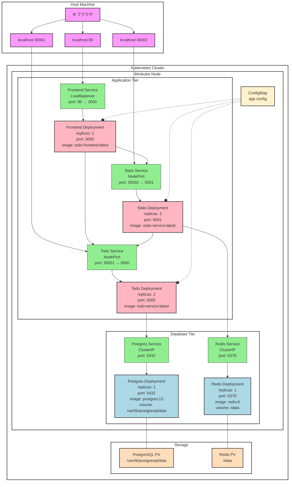

# todo-stats-app
k8s学習用アプリ
## 画面
<video src="./docs/images/capture.mov" controls="true"></video>
## 構成

## デプロイ
minikube環境にdeployする
1. minikubeのdocker環境にイメージビルド
    ```sh
    minikube start

    docker build -t todo-service:latest services/todo-service/

    # weather-service
    docker build -t weather-service:latest services/weather-service/

    # frontend
    docker build -t todo-frontend:latest services/frontend/

    kubectl apply -f k8s/base -n todo-app
    ```
2. ポートフォワーディング
    ```sh
    kubectl port-forward service/todo-service 30001:80 -n todo-app & kubectl port-forward service/stats-service 30002:80 -n todo-app &
    ```
3. frontにアクセス
    ```sh
    minikube service frontend -n todo-app
    ```
## 削除
```sh
kubectl delete -f k8s/base -n todo-app
```
## ArgoCDのアクセス
```sh
kubectl apply -f argocd/application.yaml
kubectl port-forward svc/argocd-server -n argocd 8080:443
# 127.0.0.1/8080へ
# user:admin
# password:kubectl -n argocd get secret argocd-initial-admin-secret -o jsonpath="{.data.password}" | base64 -d
```