# todo-stats-app
k8s学習用アプリ
## 画面
<video src="./docs/images/capture.mov" controls="true"></video>
## 構成

```mermaid
flowchart TD
    subgraph "Host Machine"
        B["🌐 ブラウザ"]
        B --> PF["localhost:80"]
        B --> PT["localhost:30001"]
        B --> PS["localhost:30002"]
    end

    subgraph "Kubernetes Cluster"
        subgraph "Minikube Node"
            subgraph "Application Tier"
                FD["Frontend Deployment<br/>replicas: 1<br/>port: 3000<br/>image: todo-frontend:latest"]
                TD["Todo Deployment<br/>replicas: 2<br/>port: 5000<br/>image: todo-service:latest"]
                SD["Stats Deployment<br/>replicas: 2<br/>port: 5001<br/>image: stats-service:latest"]

                FS["Frontend Service<br/>LoadBalancer<br/>port: 80 → 3000"]
                TS["Todo Service<br/>NodePort<br/>port: 30001 → 5000"]
                SS["Stats Service<br/>NodePort<br/>port: 30002 → 5001"]

                PF --> FS --> FD
                PT --> TS --> TD
                PS --> SS --> SD
            end

            subgraph "Database Tier"
                PGD["Postgres Deployment<br/>replicas: 1<br/>port: 5432<br/>image: postgres:13<br/>volume: /var/lib/postgresql/data"]
                RD["Redis Deployment<br/>replicas: 1<br/>port: 6379<br/>image: redis:6<br/>volume: /data"]

                PGS["Postgres Service<br/>ClusterIP<br/>port: 5432"]
                RS["Redis Service<br/>ClusterIP<br/>port: 6379"]

                PGS --> PGD
                RS --> RD
            end

            CM["ConfigMap<br/>app config"]
            CM -.-o FD
            CM -.-o TD
            CM -.-o SD

            %% Service Communication
            FD --> TS
            FD --> SS
            SD --> TS
            SD --> RS
            TD --> PGS
        end

        subgraph "Storage"
            PV1["PostgreSQL PV<br/>/var/lib/postgresql/data"]
            PV2["Redis PV<br/>/data"]
            PGD --- PV1
            RD --- PV2
        end
    end

    classDef external fill:#f9f,stroke:#333,stroke-width:2px
    classDef config fill:#fff2cc,stroke:#333,stroke-width:2px
    classDef service fill:#90EE90,stroke:#333,stroke-width:1px
    classDef deployment fill:#ffb6c1,stroke:#333,stroke-width:2px
    classDef database fill:#ADD8E6,stroke:#333,stroke-width:2px
    classDef storage fill:#fdb,stroke:#333,stroke-width:2px
    classDef cluster fill:#fff,stroke:#333,stroke-width:2px
    classDef node fill:#e6e6e6,stroke:#333,stroke-width:2px

    class B,PF,PT,PS external
    class CM config
    class FS,TS,SS,PGS,RS service
    class FD,TD,SD deployment
    class PGD,RD database
    class PV1,PV2 storage
    class Cluster cluster
    class Node node
```

## デプロイ
minikube環境にdeployする
1. minikubeのdocker環境にイメージビルド
    ```sh
    minikube start

    docker build -t todo-service:latest services/todo-service/

    # weather-service
    docker build -t weather-service:latest services/weather-service/

    # frontend
    docker build -t todo-frontend:latest services/frontend/

    kubectl apply -f k8s/base -n todo-app
    ```
2. ポートフォワーディング
    ```sh
    kubectl port-forward service/todo-service 30001:80 -n todo-app & kubectl port-forward service/stats-service 30002:80 -n todo-app &
    ```
3. frontにアクセス
    ```sh
    minikube service frontend -n todo-app
    ```
## 削除
```sh
kubectl delete -f k8s/base -n todo-app
```
## ArgoCDのアクセス
```sh
kubectl apply -f argocd/application.yaml
kubectl port-forward svc/argocd-server -n argocd 8080:443
# 127.0.0.1/8080へ
# user:admin
# password:kubectl -n argocd get secret argocd-initial-admin-secret -o jsonpath="{.data.password}" | base64 -d
```